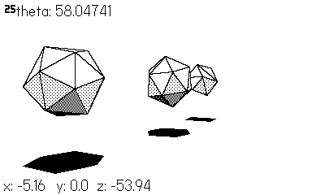

# fak3d

### A simple (but unoptimized) 3D renderer for the Playdate console.

Primarily done to learn how 3D rendering works, on some fun and niche hardware.
While performance is decent in the simulator, it runs slowly on the actual
hardware. Supports the ability to navigate using the D-Pad, and turn using the
crank.
